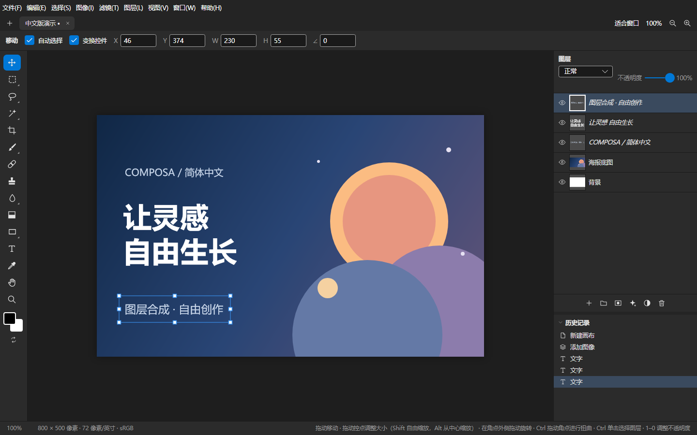

# Composa 简体中文社区版

**免费、开源的图层图像编辑器：用熟悉的中文菜单完成合成与修图。**

[](https://github.com/link43223/Composa-Chinese/actions/workflows/ci.yml)
[](LICENSE)

[下载 Windows 便携版](https://github.com/link43223/Composa-Chinese/releases) · [报告问题](https://github.com/link43223/Composa-Chinese/issues) · [English](#english) · [上游项目](https://github.com/dvdstelt/Composa)



这是 [Composa](https://github.com/dvdstelt/Composa) 的简体中文社区分支，基于上游 1.4.0，保留原作者及第三方版权。首个中文版定位为**公开测试版**，欢迎用实际作品验证并反馈。

## 下载与运行

1. 打开 [Releases](https://github.com/link43223/Composa-Chinese/releases)，下载标有 `win-x64` 的 ZIP。
2. 完整解压文件夹，运行其中的 `composa.exe`。无需另装 .NET。
3. 使用随包提供的 `sha256sums.txt` 核对下载完整性。

当前提供 Windows x64 便携包。源码支持上游的其他平台构建，其他平台中文版安装包尚未验证。中文版使用独立的设置和恢复目录，可与英文版并存。

随包 `examples/Composa-Chinese-demo.cmps` 是可编辑的演示海报，文字和底图分别保留为图层。也可从仓库的 [examples](examples/) 获取。

## 能做什么

- 图层、图层组、混合模式、透明度、图层蒙版和剪贴蒙版。
- 调整图层、曲线、色阶、色相/饱和度及 Camera Raw 滤镜。
- 描边、投影、内阴影、外发光等图层样式。
- 移动、变换、选区、裁剪、画笔、文字和形状工具。
- 保存 `.cmps` 工程，导入图像及上游支持的 PSD/XCF 文件。

PSD/XCF 导入以本软件支持的内容为准；复杂工程的兼容性仍需要实际验证。详细功能见[上游说明](docs/UPSTREAM-README.md)。

## 中文版做了什么

汉化覆盖菜单、工具选项、常用对话框、调整与滤镜、Camera Raw、图层样式、历史记录、快捷键设置、状态提示与错误说明。Photoshop 常用术语用于对照，例如“正片叠底”“色阶”“剪贴蒙版”；本软件特有功能按实际用途翻译。

文件名、用户输入、字体名、品牌及算法名称保留原样。内部命令标识和工程数据不随显示语言改写。官方自动更新默认关闭；手动检查更新指向上游英文版，并明确提示“下载官方英文版”。本分支更新请到本仓库 Releases 下载。

## 质量与已知边界

已有 277 项针对汉化的检查，覆盖菜单、混合模式、动态提示、名称保护和部分工程兼容性；渲染检查了 42 个对话框及 15 类工具选项，Windows 原生界面与独立启动也已验证。

仓库保留上游功能测试，并增加中文菜单执行、动态文件名保护和中文环境工程保存/读取测试。最新源码构建及测试结果以 [Actions](https://github.com/link43223/Composa-Chinese/actions) 为准。完整图像处理、复杂 PSD/RAW、大文件和长时间使用仍需要更多实测，不能承诺所有场景均已完善。操作系统或第三方返回的技术诊断可能保留原文。

## 免费与许可

下载和使用免费，不设试用期限、付费功能或人为次数限制。项目代码采用 [MIT 许可证](LICENSE)，允许使用、修改、分发及商用，分发时需要保留版权和许可声明。第三方库和模型按各自许可证使用，详见 [THIRD-PARTY-NOTICES](packaging/THIRD-PARTY-NOTICES.txt)。

## 从源码构建

安装 `.NET 10 SDK`、Git 和 Git Bash，然后：

```bash
git clone https://github.com/link43223/Composa-Chinese.git
cd Composa-Chinese
git fetch --tags
dotnet build --configuration Release
dotnet test --configuration Release --no-build
dotnet run --project src/Composa.App
```

构建完整 Windows 便携包（会获取并校验缺失的模型）：

```bash
scripts/package/windows.sh win-x64 dist --no-installer
```

版本由 Git 标签和 MinVer 决定。翻译资源及修改原则见 [CHINESE-LOCALIZATION.md](CHINESE-LOCALIZATION.md)；参与贡献见 [CONTRIBUTING.md](CONTRIBUTING.md)。

## 致谢

Composa 由 Dennis van der Stelt 开发；部分概念和实现源自 Robbie Tilton 的 Compositor。保留上游版权与完整开发历史。中文术语参考 Adobe 官方中文文档；本项目与 Adobe 无关联。

## English

**Composa Chinese** is a free, open-source Simplified Chinese community edition of [Composa](https://github.com/dvdstelt/Composa), based on upstream 1.4.0. It translates presentation strings while preserving user text, filenames, command identifiers and document data.

The initial release is a **public preview**, with a Windows x64 portable download. The repository retains upstream history and regression tests, adds Chinese-specific tests, and uses MIT for project code. Bundled dependencies and models retain their respective licenses. Automatic upstream updates are disabled by default because upstream downloads are English builds.

Download from [Releases](https://github.com/link43223/Composa-Chinese/releases). Report translation or compatibility issues through [Issues](https://github.com/link43223/Composa-Chinese/issues).
